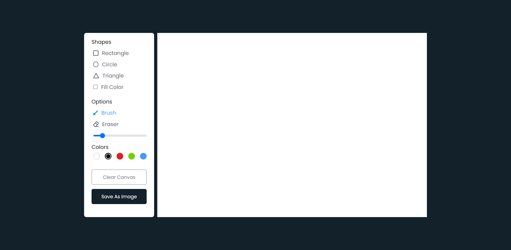

 
 

<h1 align="center"> Drawing App </h1>
 

## Description

 
 A simple paint app in html, css, js which allows user to draw different kind of shapes. In this app user can draw different shapes like rectangles, circles and triangles in their prefered colors. They can also erase or download their drawing as an image. All these functionalities are done with HTML 5 Canvas and vanilla javascript, no external framework or library is used.  
 The user can simply choose to draw the shape of ther own choice. The toggling effect between the shapes allows the user to identify the currently chosen shape of the canvas. Once the user clicks on the shape, it is colored with <strong> #4A98f7 </strong> colored text which shows that the particukar shape has been selected and is in use. The user can simply then click and drag the mouse to create the shapes of their desires.

  

## Features
 
Following are some of the new features and learning encountered while creating this amazing project:

- We can snapshot the canvas current state at any point for further usage.
- We can also change the color of the brush as per requirement.
  

## Resources
 
Follwing resources have been used in maintaining this project:

- [Color Palletes](https://colorpalettes.colorion.co/#14) for choosing the theme of the website.
  

## Demo
  

## Link To Video
  

## Graphical User Interface

  

## Technology Stack
 
Follwing technologies have been used at the core of this application to make it stand in the market place:

- HTML
- CSS
- JS
- Canvas
  

## Advancement
> No advancement required
  

## Deployment Details
 
The website is deployed using the free hosting provided by **Vercel**

  

  
Later on the link was customized using the well known url shortner and customizer **Rebrandly**:  

  

  

## Developer
Muhammad Abdullah Butt  
abdullahbutt12292210@gmail.com  
> [Instagram](https://www.instagram.com/abdullah.butt.22/) 
> [FaceBook](https://www.facebook.com/profile.php?id=100076291614529) 
> [YouTube](https://www.youtube.com/channel/UCnuOFQyMywg-KuoN-lmav1Q) 
> [Portfolio](https://rebrand.ly/muhammadabdullahPortfolio) 
> [Website](#)

